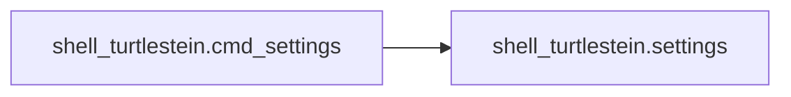
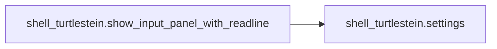
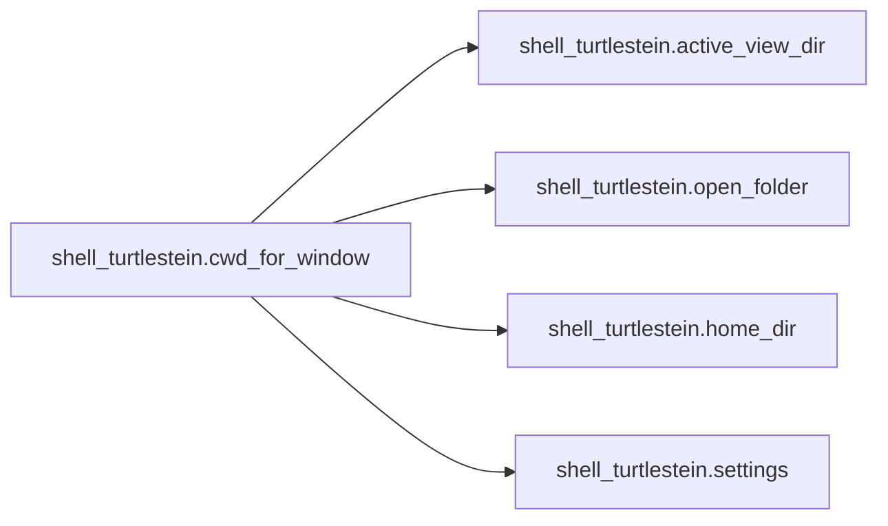
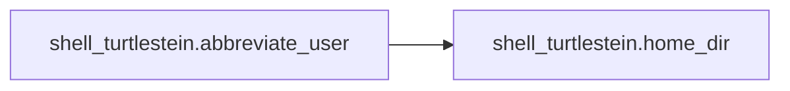

# Key Objects

[_Documentation generated by Documatic_](https://www.documatic.com)

<!---Documatic-section-shell_turtlestein.settings-start--->
## shell_turtlestein.settings

<!---Documatic-section-settings-start--->
<!---Documatic-block-shell_turtlestein.settings-start--->
<details>
	<summary><code>shell_turtlestein.settings</code> code snippet</summary>

```python
def settings():
    return sublime.load_settings('Shell Turtlestein.sublime-settings')
```
</details>
<!---Documatic-block-shell_turtlestein.settings-end--->
<!---Documatic-section-settings-end--->

# #
<!---Documatic-section-shell_turtlestein.settings-end--->

<!---Documatic-section-shell_turtlestein.parse_cmd-start--->
## shell_turtlestein.parse_cmd

<!---Documatic-section-parse_cmd-start--->
<!---Documatic-block-shell_turtlestein.parse_cmd-start--->
<details>
	<summary><code>shell_turtlestein.parse_cmd</code> code snippet</summary>

```python
def parse_cmd(cmd_str):
    return re.match('\\s*(?P<input>\\|)?\\s*(?P<shell_cmd>.*?)\\s*(?P<output>[|>])?\\s*$', cmd_str).groupdict()
```
</details>
<!---Documatic-block-shell_turtlestein.parse_cmd-end--->
<!---Documatic-section-parse_cmd-end--->

# #
<!---Documatic-section-shell_turtlestein.parse_cmd-end--->

<!---Documatic-section-shell_turtlestein.cmd_settings-start--->
## shell_turtlestein.cmd_settings

<!---Documatic-section-cmd_settings-start--->


### Object Calls

* shell_turtlestein.settings

<!---Documatic-block-shell_turtlestein.cmd_settings-start--->
<details>
	<summary><code>shell_turtlestein.cmd_settings</code> code snippet</summary>

```python
def cmd_settings(cmd):
    d = {}
    for setting in ['exec_args', 'surround_cmd']:
        d[setting] = settings().get(setting)
    try:
        settings_for_cmd = next((c for c in settings().get('cmd_settings') if re.search(c['cmd_regex'], cmd)))
        d.update(settings_for_cmd)
    except StopIteration:
        pass
    return d
```
</details>
<!---Documatic-block-shell_turtlestein.cmd_settings-end--->
<!---Documatic-section-cmd_settings-end--->

# #
<!---Documatic-section-shell_turtlestein.cmd_settings-end--->

<!---Documatic-section-shell_turtlestein.run_cmd-start--->
## shell_turtlestein.run_cmd

<!---Documatic-section-run_cmd-start--->


### Object Calls

* shell_turtlestein.show_in_output_panel

<!---Documatic-block-shell_turtlestein.run_cmd-start--->
<details>
	<summary><code>shell_turtlestein.run_cmd</code> code snippet</summary>

```python
def run_cmd(cwd, cmd, wait, input_str=None):
    shell = isinstance(cmd, str)
    if wait:
        proc = subprocess.Popen(cmd, cwd=cwd, shell=shell, stdout=subprocess.PIPE, stderr=subprocess.PIPE, stdin=subprocess.PIPE if input_str else None)
        encoded_input = None if input_str == None else input_str.encode('utf8')
        (output, error) = proc.communicate(encoded_input)
        return_code = proc.poll()
        if return_code:
            show_in_output_panel('`%s` exited with a status code of %s\n\n%s' % (cmd, return_code, error))
            return (False, None)
        else:
            return (True, output.decode('utf8'))
    else:
        subprocess.Popen(cmd, cwd=cwd, shell=shell)
        return (False, None)
```
</details>
<!---Documatic-block-shell_turtlestein.run_cmd-end--->
<!---Documatic-section-run_cmd-end--->

# #
<!---Documatic-section-shell_turtlestein.run_cmd-end--->

<!---Documatic-section-shell_turtlestein.active_view_dir-start--->
## shell_turtlestein.active_view_dir

<!---Documatic-section-active_view_dir-start--->
<!---Documatic-block-shell_turtlestein.active_view_dir-start--->
<details>
	<summary><code>shell_turtlestein.active_view_dir</code> code snippet</summary>

```python
def active_view_dir(active_file_name):
    if active_file_name:
        return os.path.dirname(active_file_name)
```
</details>
<!---Documatic-block-shell_turtlestein.active_view_dir-end--->
<!---Documatic-section-active_view_dir-end--->

# #
<!---Documatic-section-shell_turtlestein.active_view_dir-end--->

<!---Documatic-section-shell_turtlestein.show_in_output_panel-start--->
## shell_turtlestein.show_in_output_panel

<!---Documatic-section-show_in_output_panel-start--->
<!---Documatic-block-shell_turtlestein.show_in_output_panel-start--->
<details>
	<summary><code>shell_turtlestein.show_in_output_panel</code> code snippet</summary>

```python
def show_in_output_panel(message):
    window = sublime.active_window()
    panel_name = 'shell_turtlestein'
    panel = window.get_output_panel(panel_name)
    edit = panel.begin_edit()
    panel.insert(edit, 0, message)
    panel.end_edit(edit)
    window.run_command('show_panel', {'panel': 'output.' + panel_name})
```
</details>
<!---Documatic-block-shell_turtlestein.show_in_output_panel-end--->
<!---Documatic-section-show_in_output_panel-end--->

# #
<!---Documatic-section-shell_turtlestein.show_in_output_panel-end--->

<!---Documatic-section-shell_turtlestein.open_folder-start--->
## shell_turtlestein.open_folder

<!---Documatic-section-open_folder-start--->
<!---Documatic-block-shell_turtlestein.open_folder-start--->
<details>
	<summary><code>shell_turtlestein.open_folder</code> code snippet</summary>

```python
def open_folder(window, active_file_name):
    folders = window.folders()
    if len(folders) == 1:
        return folders[0]
    if not active_file_name:
        return folders[0] if len(folders) else None
    for folder in folders:
        if active_file_name.startswith(folder):
            return folder
```
</details>
<!---Documatic-block-shell_turtlestein.open_folder-end--->
<!---Documatic-section-open_folder-end--->

# #
<!---Documatic-section-shell_turtlestein.open_folder-end--->

<!---Documatic-section-shell_turtlestein.show_input_panel_with_readline-start--->
## shell_turtlestein.show_input_panel_with_readline

<!---Documatic-section-show_input_panel_with_readline-start--->


### Object Calls

* shell_turtlestein.settings

<!---Documatic-block-shell_turtlestein.show_input_panel_with_readline-start--->
<details>
	<summary><code>shell_turtlestein.show_input_panel_with_readline</code> code snippet</summary>

```python
def show_input_panel_with_readline(window, caption, cmd_history, on_done, on_change, on_cancel):
    global active_input_row
    active_input_row = -1
    view = window.show_input_panel(caption, '\n'.join(cmd_history) + '\n', partial(callback_with_history, on_done, cmd_history), on_change, on_cancel)
    view.settings().set('readline_input_widget', True)
    view.show(view.size())
    return view
```
</details>
<!---Documatic-block-shell_turtlestein.show_input_panel_with_readline-end--->
<!---Documatic-section-show_input_panel_with_readline-end--->

# #
<!---Documatic-section-shell_turtlestein.show_input_panel_with_readline-end--->

<!---Documatic-section-shell_turtlestein.cwd_for_window-start--->
## shell_turtlestein.cwd_for_window

<!---Documatic-section-cwd_for_window-start--->


### Object Calls

* shell_turtlestein.active_view_dir
* shell_turtlestein.open_folder
* shell_turtlestein.home_dir
* shell_turtlestein.settings

<!---Documatic-block-shell_turtlestein.cwd_for_window-start--->
<details>
	<summary><code>shell_turtlestein.cwd_for_window</code> code snippet</summary>

```python
def cwd_for_window(window):
    active_view = window.active_view()
    active_file = active_view.file_name() if active_view else None
    if settings().get('prefer_active_view_dir') == True:
        return active_view_dir(active_file) or open_folder(window, active_file) or home_dir()
    else:
        return open_folder(window, active_file) or active_view_dir(active_file) or home_dir()
```
</details>
<!---Documatic-block-shell_turtlestein.cwd_for_window-end--->
<!---Documatic-section-cwd_for_window-end--->

# #
<!---Documatic-section-shell_turtlestein.cwd_for_window-end--->

<!---Documatic-section-shell_turtlestein.abbreviate_user-start--->
## shell_turtlestein.abbreviate_user

<!---Documatic-section-abbreviate_user-start--->


### Object Calls

* shell_turtlestein.home_dir

<!---Documatic-block-shell_turtlestein.abbreviate_user-start--->
<details>
	<summary><code>shell_turtlestein.abbreviate_user</code> code snippet</summary>

```python
def abbreviate_user(path):
    home = home_dir()
    if path.startswith(home):
        return '~' + path[len(home):]
    else:
        return path
```
</details>
<!---Documatic-block-shell_turtlestein.abbreviate_user-end--->
<!---Documatic-section-abbreviate_user-end--->

# #
<!---Documatic-section-shell_turtlestein.abbreviate_user-end--->

<!---Documatic-section-shell_turtlestein.callback_with_history-start--->
## shell_turtlestein.callback_with_history

<!---Documatic-section-callback_with_history-start--->
<!---Documatic-block-shell_turtlestein.callback_with_history-start--->
<details>
	<summary><code>shell_turtlestein.callback_with_history</code> code snippet</summary>

```python
def callback_with_history(callback, cmd_history, input_text):
    if callback:
        cmd = input_text.split('\n')[active_input_row]
        if cmd in cmd_history:
            cmd_history.remove(cmd)
        cmd_history.append(cmd)
        return callback(cmd)
```
</details>
<!---Documatic-block-shell_turtlestein.callback_with_history-end--->
<!---Documatic-section-callback_with_history-end--->

# #
<!---Documatic-section-shell_turtlestein.callback_with_history-end--->

<!---Documatic-section-shell_turtlestein.home_dir-start--->
## shell_turtlestein.home_dir

<!---Documatic-section-home_dir-start--->
<!---Documatic-block-shell_turtlestein.home_dir-start--->
<details>
	<summary><code>shell_turtlestein.home_dir</code> code snippet</summary>

```python
def home_dir():
    return os.path.expanduser('~')
```
</details>
<!---Documatic-block-shell_turtlestein.home_dir-end--->
<!---Documatic-section-home_dir-end--->

# #
<!---Documatic-section-shell_turtlestein.home_dir-end--->

[_Documentation generated by Documatic_](https://www.documatic.com)